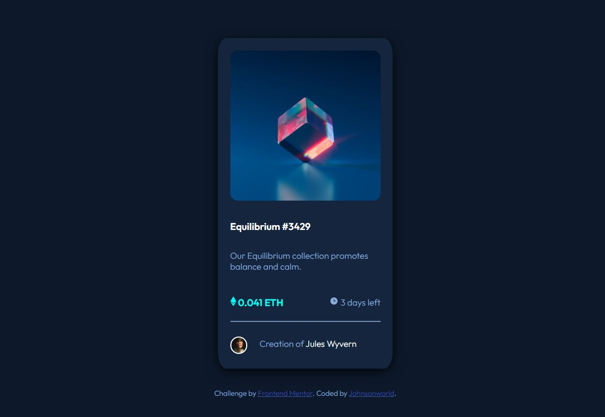

# Frontend Mentor - NFT preview card component solution

This is a solution to the [NFT preview card component challenge on Frontend Mentor](https://www.frontendmentor.io/challenges/nft-preview-card-component-SbdUL_w0U). Frontend Mentor challenges help you improve your coding skills by building realistic projects. 

## Table of contents

- [Overview](#overview)
  - [The challenge](#the-challenge)
  - [Screenshot](#screenshot)
  - [Links](#links)
- [My process](#my-process)
  - [Built with](#built-with)
  - [What I learned](#what-i-learned)
  - [Continued development](#continued-development)
- [Author](#author)

## Overview

This is a Frontend Mentor challenge to create an NFT preview card in both mobile and desktop sizing.

### The challenge

Users should be able to:

- View the optimal layout depending on their device's screen size
- See hover states for interactive elements

### Screenshot

Screenshot of desktop version.

### Links

- Solution URL: [Add solution URL here](https://your-solution-url.com)
- Live Site URL: [Add live site URL here](https://your-live-site-url.com)

## My process

I built out the semantic HTML markup first, then css.  With CSS I focused on the layout elements and attributes first and then display and typography.  Finally I built the hover elements and styled.

### Built with

- Semantic HTML5 markup
- CSS custom properties
- Flexbox
- CSS Grid
- Mobile-first workflow
- Media query

### What I learned

I decided to just use HTML and CSS for this challenge and wanted to focus on positioning. I learned that if I don't compartmentalize and focus on layout first, too many balls will be up in the air and it'll get too confusing.  I also learned that throwing everything at it but the kitchen sink is not a good process when something is not working.  Will use developer tools to troubleshoot better, I've learned new ways to do that.  

The process of overlaying the image and hovering was very useful and helped me understand more about pseudo-classes work and positioning.  

Next time (or if I refactor), I will try the following:

- Using Bootstrap card library
- Trying to do it with out using absolute or relative positioning, and focusing on Flexbox and Grid for the whole layout.

### Continued development

I feel very comfortable with HTML, less so with CSS - specifically in layout and when to use float vs. flexbox vs. grid.  I'm going to try and just focus on flexbox and grid (and get comfortable with one before working more with the other) and not worry too much about float.

### Useful resources

- Various Kevin Powell videos on YouTube for CSS.
- [CSS image overlay](https://www.w3schools.com/howto/howto_css_image_overlay.asp) - This helped me work through the image overlay.

## Author

- Website - [Johnsonworld](https://johnsonworld.github.io/fementor-previewcard/)
- Frontend Mentor - [@Johnsonworld](https://www.frontendmentor.io/profile/Johnsonworld)

